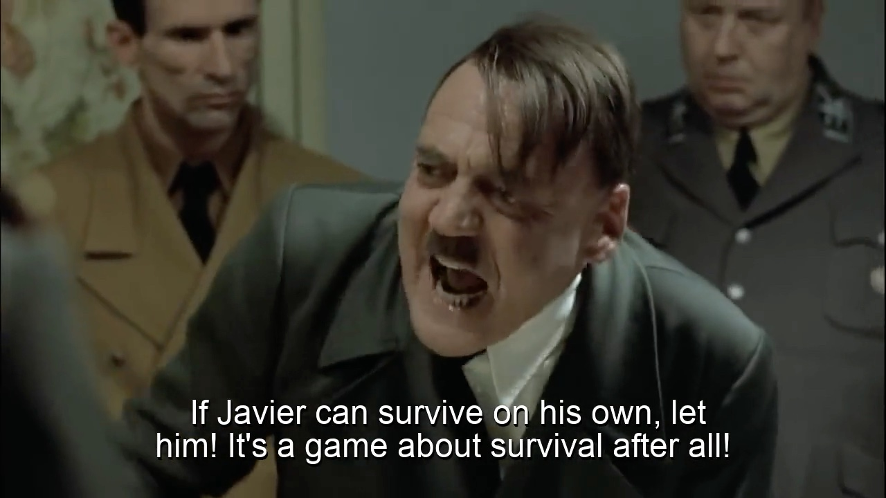

# VemeGen
Command-line tool to generate vemes (video memes), including Hitler Reacts vemes, from a customizable script.

About     | Current Release
----------|-----------------------
Version   | 1.0
Date      | June 3, 2023
Platforms | macOS
License   | [MIT License](LICENSE)
Author    | Brom Bresenham

# Installation

## New Installation

1. Install [morlock.sh](https://morlock.sh)
2. `morlock install brombres/vimage`

## Updating Existing Installation
`morlock update shellview`

# Usage

## Hitler Reacts Veme
    vemegen --create --type=HitlerReacts MyHRScript.txt
    # (edit MyHRScript.txt)
    vemegen MyHRScript.txt --preview  # --preview is faster
    vemegen MyHRScript.txt            # Release quality

## Custom Meme (Type "XYZ")
    vemegen --create --type=XYZ MyXYZScript.txt
    # (edit MyXYZScript.txt)
    vemegen MyXYZScript.txt --preview  # --preview is faster
    vemegen MyXYZScript.txt            # Release quality

# Examples

## Hitler Reacts: "Outlast" TV Show

[Examples/Hitler-Reacts-Outlast-TV-Show.txt](Examples/Hitler-Reacts-Outlast-TV-Show.txt)
